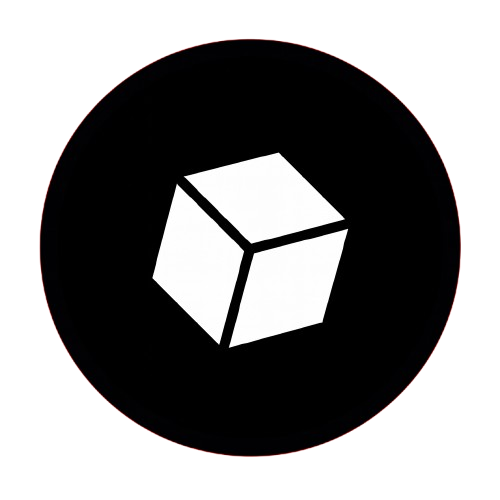

  

<h1 align="center">Hello World!</h1>

  

<h3 align="center">💫 About Me 💫</h3>

Hey there, I’m Dipangshu — A developer who loves building, breaking,  
& learning

<h3 align="center">❔ What drives me ❓</h3>

Architecting clean, performant web experiences, 
Solving problems with ruthless efficiency,  
Exploring tech ecosystems just to see how deep the rabbit hole goes,  
Keeping my workflow ultra-minimal, ultra-fast
  

<h3 align="center">❓ What I’m currently doing ❔</h3>

Building personal tools, utilities, and experimental projects 
,Exploring Linux internals, Android tweakability, and system design  
,Leveling up my dev stack through practical, real-world coding

<h3 align="center">❔ What I enjoy ❓</h3>

Coding,Gaming,Debugging systems at 3 AM for no reason & Breaking environments just to fix them cleaner
  

### 📊 GitHub Analytics

  

....BTW • If you're into clean code, automation, or high-performance workflows — we’re already aligned....

